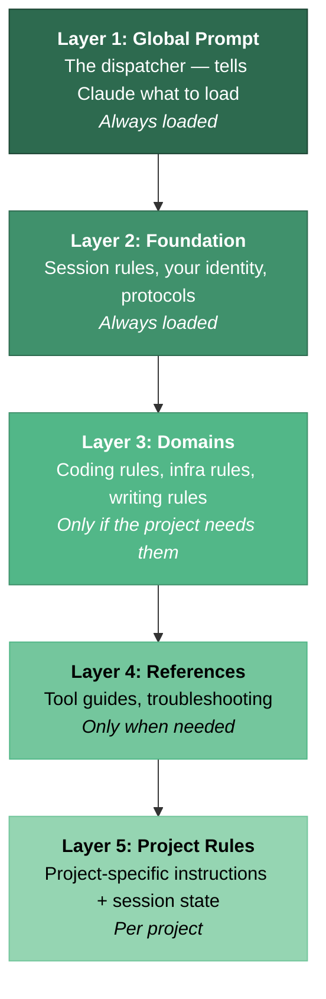
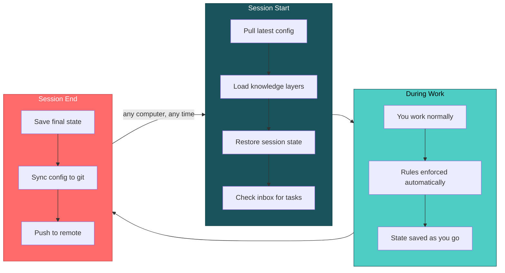
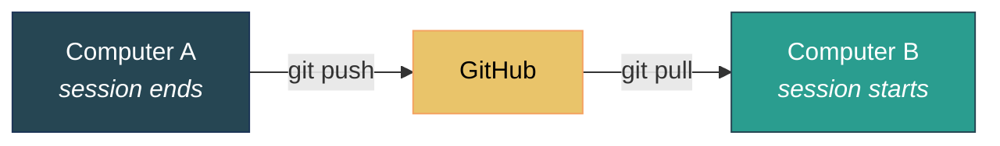

# Claude Config Template

**Multi-project, multi-machine configuration system for Claude Code.**

Claude Code now has built-in memory — it remembers project patterns and preferences across sessions. That's a great foundation. But if you work across multiple projects, use multiple computers, or want Claude to follow domain-specific workflows, you need more structure.

This system adds:

- **Multi-project coordination** — projects pass tasks to each other via an inbox
- **Multi-machine sync** — close your laptop, open your desktop, same context (via git)
- **Layered knowledge** — domain rules (coding, infra, writing) load only when the project needs them
- **Session persistence** — structured state that survives crashes and context resets, with recovery instructions
- **Self-healing protocols** — when Claude makes the same mistake twice, it auto-generates a rule to prevent it
- **MCP servers** — GitHub, Gmail, browser automation, diagrams, and more, pre-configured

---

## Quick Start

### What you need

- **A computer** running Linux, macOS, or Windows with WSL
- **Claude Code** installed ([installation guide](https://docs.anthropic.com/en/docs/claude-code/getting-started))
- **git** installed (`sudo apt install git` on Ubuntu/WSL, `brew install git` on macOS)
- **Node.js 18+** installed (`sudo apt install nodejs npm` on Ubuntu/WSL, `brew install node` on macOS)

### Windows users

Claude Code runs inside WSL (Windows Subsystem for Linux). If you haven't set up WSL yet:

1. Open PowerShell as Administrator
2. Run: `wsl --install`
3. Restart your computer
4. Open the "Ubuntu" app from your Start menu — this gives you a Linux terminal
5. Everything below happens inside that terminal

### Setup (5 minutes)

**1. Fork this repo** on GitHub (click the Fork button above), then:

```bash
git clone https://github.com/YOUR_USERNAME/claude-config ~/claude-config
cd ~/claude-config
bash setup.sh
```

**2. Answer a few questions** — your name, role, and how you like Claude to communicate.

**3. Optionally set up integrations** — the script asks about GitHub, Gmail, and other services. Skip any you don't need; you can add them later.

**4. Done.** Open Claude Code in any project and it will automatically use your new configuration.

> New to all of this? See [docs/getting-started.md](docs/getting-started.md) for a detailed walkthrough.

---

## What Changes After Setup

### Stock Claude Code

- Per-project auto memory and CLAUDE.md
- No connection between projects
- No sync between computers
- MCP servers configured per-project

### With this system

- Structured session state with crash recovery and handoff instructions
- Knowledge organized in 5 layers — domain rules load only when needed
- Projects pass tasks to each other via a cross-project inbox
- Config syncs across all your computers via git
- MCP servers configured once, work everywhere
- Domain protocols (TDD, publishing, infrastructure) enforce quality automatically

---

## How It Works

You don't need to understand this to use it, but here's the architecture for the curious.

### 5 Knowledge Layers



The key idea: Claude doesn't load everything at once. A coding project loads coding rules. An infrastructure project loads server rules. This keeps Claude fast and focused.

### Session Flow



This all happens automatically. You just use Claude normally.

---

## What's in the Box

### Directory Structure

```
claude-config/
│
├── setup.sh                       Run this first — sets everything up
├── sync.sh                        Keeps config in sync (automated by hooks)
├── registry.md                    List of your projects
│
├── global/
│   ├── CLAUDE.md                  The main prompt (the "dispatcher")
│   ├── foundation/                Core rules: sessions, identity, protocols
│   ├── domains/                   Topic-specific rules (coding, infra, etc.)
│   ├── reference/                 Tool guides, troubleshooting docs
│   ├── knowledge/                 Operational notes (tool-specific tips)
│   ├── machines/                  Per-computer configuration
│   └── hooks/                     Auto-sync scripts
│
├── projects/
│   └── _example/rules/CLAUDE.md   Example project config
│
└── cross-project/
    ├── inbox.md                   Task passing between projects
    └── *-strategy.md              Shared state files
```

### Sync Tool (sync.sh)

| Command | What it does |
|---------|-------------|
| `bash sync.sh setup` | **Run once per computer.** Creates symlinks, installs hooks. |
| `bash sync.sh deploy` | Push config changes to live locations. Safe to repeat. |
| `bash sync.sh collect` | Pull changes from live locations back into the repo. |
| `bash sync.sh status` | Health check — shows what's linked, what's out of sync. |

### MCP Servers (pre-configured)

MCP servers let Claude interact with external services. Setup prompts you for each one.

| Server | What it does | Needs credentials? |
|--------|-------------|:------------------:|
| **GitHub** | Manage repos, issues, pull requests | Yes (PAT) |
| **Google Workspace** | Gmail, Google Docs, Calendar, Drive | Yes (OAuth) |
| **Twitter/X** | Post tweets | Yes (API keys) |
| **Jira** | Issues, sprints, Confluence | Yes (API token) |
| **PostgreSQL** | Database queries | Yes (connection URL) |
| **Serena** | Navigate code semantically | No |
| **Playwright** | Automate browsers, take screenshots | No |
| **Memory** | Persistent knowledge graph | No |
| **Diagram** | Generate Mermaid diagrams | No |

Skip any you don't need. You can add them later.

### Included Domains

Domains are topic-specific rule sets. Each project declares which ones it needs.

| Domain | What it teaches Claude |
|--------|----------------------|
| **Software Development** | Test-driven development, code review conventions |
| **Publications** | Markdown to PDF pipeline, content quality |
| **Engagement** | Community interaction, social media etiquette |
| **IT Infrastructure** | Server management, Docker, DNS, deployment |

Add your own: copy `global/domains/_template/`, edit it, reference it from your project's config.

---

## Common Tasks

### Add a new project

Open Claude Code in any project directory. Tell it "set up this project" and it will:
- Create a project config file
- Add the project to the registry
- Set up session tracking

Or do it manually: create `<your-project>/.claude/CLAUDE.md` using the example in `projects/_example/rules/CLAUDE.md`.

### Set up a second computer

```bash
git clone YOUR_REPO_URL ~/claude-config
cd ~/claude-config
bash setup.sh
```

Same process. Your config syncs via git — push from one machine, pull on the other.

### Pass a task between projects

Add a line to `cross-project/inbox.md`:

```
- [ ] **target-project**: Description of what needs to happen
```

Next time Claude opens that project, it picks up the task automatically.

### Customize how Claude communicates

Edit `global/foundation/user-profile.md` with your preferences. Changes take effect next session.

---

## Multi-Machine Sync



No computer is special. Clone the repo, run `setup.sh`, and any machine is a full participant. Session hooks handle the git push/pull automatically.

---

## Platform Support

| | Linux | macOS | WSL (Windows) |
|--|:-----:|:-----:|:-------------:|
| **Works?** | Yes | Yes | Yes |
| **Open files** | `xdg-open` | `open` | `powershell.exe` |
| **Note** | — | — | Avoid working in `/mnt/c/` (slow) |

---

## Troubleshooting

**Claude doesn't see my MCP servers** — Restart Claude Code. MCP servers load at startup.

**GitHub returns "Not Found" on private repos** — The env var must be `GITHUB_PERSONAL_ACCESS_TOKEN` (not `GITHUB_TOKEN`). Check `~/.mcp.json`.

**Session state not persisting** — Make sure you're running Claude from a directory that has `session-context.md`, or from `~/claude-config/` itself.

**Symlinks broken after git pull** — Run `bash sync.sh setup` to recreate them.

**Something feels wrong** — Run `bash sync.sh status` for a health check.

---

## License

MIT — see [LICENSE](LICENSE).
