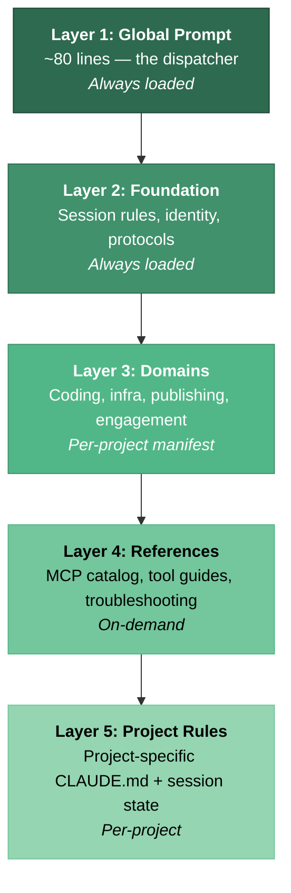
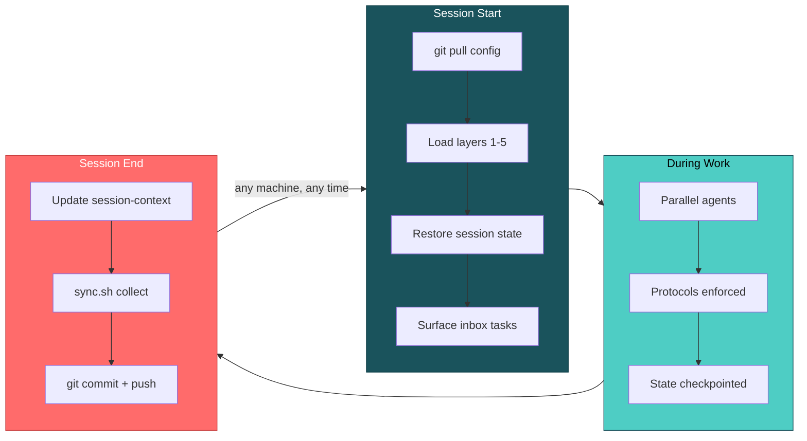
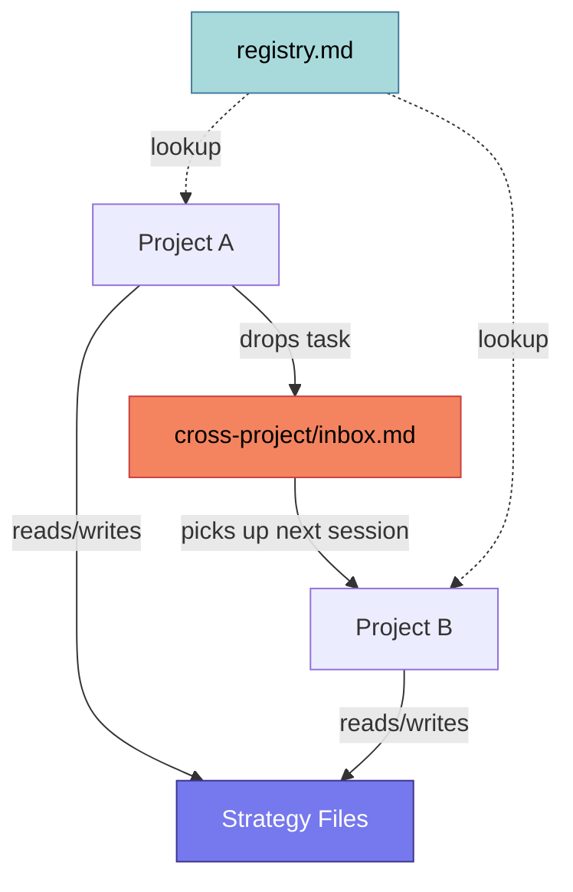
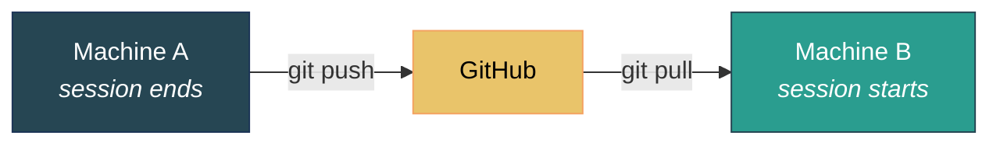

# Claude Config Template

**Session memory, layered knowledge, multi-machine sync, and self-healing protocols for Claude Code.**

Works on Linux, macOS, and WSL.

```bash
git clone https://github.com/JeltzProstetnic/claude-config-template ~/claude-config
cd ~/claude-config && bash setup.sh
```

---

## The Problem

Claude Code is a powerful AI agent. But out of the box:

- **No memory** — every session starts cold
- **No multi-project awareness** — 10 projects = 10 disconnected configs
- **No cross-machine sync** — switch computers, lose everything
- **No structured knowledge** — everything crammed into one `CLAUDE.md`

This system fixes all of that.

---

## What You Get

<table>
<tr><td>✅</td><td><strong>Session Memory</strong></td><td>AI picks up where it left off. Crashes, timeouts, machine switches — nothing lost.</td></tr>
<tr><td>✅</td><td><strong>Smart Knowledge Loading</strong></td><td>Each project declares what it needs. Coding gets TDD rules. Infra gets server protocols. No bloat.</td></tr>
<tr><td>✅</td><td><strong>Cross-Project Inbox</strong></td><td>Projects pass tasks to each other automatically. No manual coordination.</td></tr>
<tr><td>✅</td><td><strong>Multi-Machine Sync</strong></td><td>Close laptop, open desktop — same context, same rules. Zero manual steps.</td></tr>
<tr><td>✅</td><td><strong>Self-Healing Protocols</strong></td><td>Repeated mistakes auto-generate prevention rules for all future sessions.</td></tr>
<tr><td>✅</td><td><strong>9 MCP Servers</strong></td><td>GitHub, Gmail, Jira, browser automation, diagrams, and more — pre-configured.</td></tr>
<tr><td>✅</td><td><strong>One-Command Deploy</strong></td><td>Clone, run setup, done. Same config on every machine.</td></tr>
</table>

---

## How It Compares

| Feature | Claude Code (stock) | **This System** |
|---------|:-------------------:|:---------------:|
| Session memory | ❌ Starts cold every time | ✅ Full persistence + crash recovery |
| Knowledge management | ❌ One flat `CLAUDE.md` | ✅ 5-layer architecture |
| Multi-project support | ❌ Each project isolated | ✅ Inbox + shared strategy files |
| Multi-machine sync | ❌ Manual | ✅ Automatic via git hooks |
| Error prevention | ❌ Same mistakes repeat | ✅ Self-healing protocols |
| MCP server management | ❌ Per-project setup | ✅ Central config, auto-enabled |
| Audit trail | ❌ None | ✅ Full git history |

---

## Architecture: 5 Layers

The AI doesn't load everything. Each project declares what it needs. Context stays focused.



**The global prompt is a dispatcher, not a knowledge store.** It stays small and stable. Knowledge scales independently in the layers below.

---

## How a Session Works



Hooks automate start and end. No manual git commands needed.

---

## Quick Start

```bash
git clone https://github.com/JeltzProstetnic/claude-config-template ~/claude-config
cd ~/claude-config && bash setup.sh
```

`setup.sh` handles everything:

| Step | What happens |
|:----:|-------------|
| 1 | Detects platform (Linux, macOS, WSL) |
| 2 | Checks prerequisites (git, `~/.claude/`) |
| 3 | Generates your user profile from interactive prompts |
| 4 | Creates machine tool catalog (installed tools + versions) |
| 5 | Symlinks `~/.claude/` directories to this repo |
| 6 | Installs session hooks for automatic git sync |
| 7 | **Launches Claude for interactive refinement** — personalize profile, choose domains, set up first project |

Non-interactive: `bash setup.sh --non-interactive`

---

## Directory Structure

```
claude-config/
│
├── setup.sh                        One-command bootstrap
├── sync.sh                         Bidirectional sync (4 modes)
├── registry.md                     Project phone book
│
├── global/
│   ├── CLAUDE.md                   Global prompt (the dispatcher)
│   ├── foundation/                 Always loaded: session rules, protocols
│   ├── domains/                    Per-project: coding, infra, publishing
│   ├── reference/                  On-demand: MCP catalog, tool guides
│   ├── knowledge/                  Tool-specific operational notes
│   ├── machines/                   Per-machine state and config
│   └── hooks/                      Auto-sync on session start/end
│
├── projects/
│   └── _example/rules/CLAUDE.md    Example project manifest
│
└── cross-project/
    ├── inbox.md                    Async task passing
    └── *-strategy.md              Shared state for overlapping projects
```

Global files are **symlinked** — edit in the repo or in `~/.claude/`, same file. Hooks are **copied** for execution reliability.

---

## sync.sh — Four Modes

| Mode | What it does |
|------|-------------|
| `setup` | **One-time.** Creates symlinks, copies hooks. Idempotent. |
| `deploy` | Push repo to live locations. Checks for template drift. Safe to repeat. |
| `collect` | Pull live changes back into repo. |
| `status` | Health check: symlinks, sync state, inbox count, strategy file age. |

---

## MCP Servers (9 Pre-Configured)

<table>
<tr>
<th colspan="3">Credential-based — prompted during setup (skip any you don't need)</th>
</tr>
<tr><td><b>GitHub</b></td><td>Repos, issues, PRs, code search</td><td>PAT</td></tr>
<tr><td><b>Google Workspace</b></td><td>Gmail, Docs, Sheets, Calendar, Drive</td><td>OAuth</td></tr>
<tr><td><b>Twitter/X</b></td><td>Post tweets (never autonomous)</td><td>API keys</td></tr>
<tr><td><b>Jira/Atlassian</b></td><td>Issues, sprints, Confluence</td><td>API token</td></tr>
<tr><td><b>PostgreSQL</b></td><td>Direct SQL queries</td><td>Connection URL</td></tr>
<tr>
<th colspan="3">Always-on — no credentials needed</th>
</tr>
<tr><td><b>Serena</b></td><td>Semantic code navigation</td><td>—</td></tr>
<tr><td><b>Playwright</b></td><td>Browser automation, screenshots, forms</td><td>—</td></tr>
<tr><td><b>Memory</b></td><td>Persistent knowledge graph (JSONL)</td><td>—</td></tr>
<tr><td><b>Diagram Bridge</b></td><td>Diagram rendering via Kroki.io (Mermaid, Graphviz, PlantUML, etc.)</td><td>—</td></tr>
</table>

Full details: `global/reference/mcp-catalog.md`

---

## Included Domains

| Domain | What it enforces |
|--------|-----------------|
| **Software Development** | Test-driven development with explicit escape hatches |
| **Publications** | Markdown → LaTeX → PDF pipeline, content integrity testing |
| **Engagement** | Discourse scanning, reply drafting, thread etiquette |
| **IT Infrastructure** | Server management, Docker conventions, DNS/SSL |

Add your own: copy `global/domains/_template/`, adapt, reference from your project manifest.

---

## Cross-Project Coordination



**Hard rule:** Never write directly into another project's files. Use the inbox or strategy files.

---

## Multi-Machine Sync



No machine is special. Clone the repo, run `setup.sh`, and any machine is a full participant.

---

## Platform Support

| | Linux | macOS | WSL |
|--|:-----:|:-----:|:---:|
| **Supported** | ✅ | ✅ | ✅ |
| **Open files** | `xdg-open` | `open` | `powershell.exe` |
| **Performance** | Native | Native | Avoid `/mnt/c/` |

---

## cc-mirror Integration

Designed to work with [cc-mirror](https://github.com/nicobailey/cc-mirror) for multi-agent variants:

- **Named variants** — separate configs per role (`mclaude`, `devops`, `writer`)
- **129+ VoltAgent subagents** — infrastructure, QA, data/AI, research, business
- **Per-variant MCP servers** — each variant gets its own tool stack

Also works with vanilla Claude Code — just uses `~/.claude/` paths.

---

## License

MIT — see [LICENSE](LICENSE).
