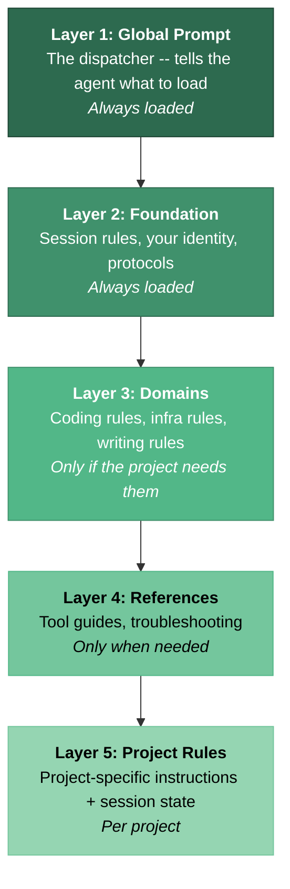
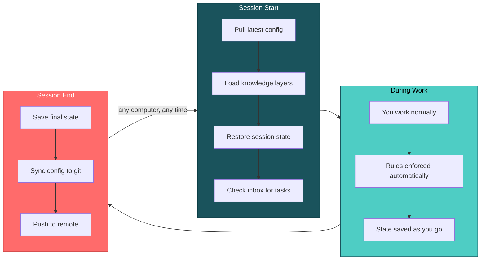
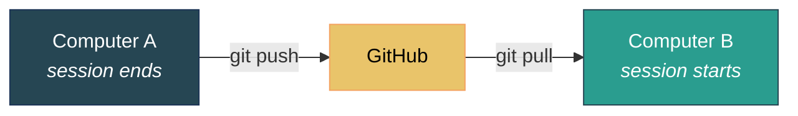

# Agent Fleet

A persistent, multi-project, multi-machine AI agent that manages your development infrastructure through conversation.

## Install, Launch, Talk

```bash
git clone https://github.com/JeltzProstetnic/agent-fleet ~/agent-fleet
cd ~/agent-fleet && bash setup.sh
afleet
```

The agent introduces itself and asks how you work -- your projects, your communication style, your tools. No forms. No config files. Just a conversation. Everything after this point is "tell the agent what you need."

> **Want your own copy?** On GitHub, click "Use this template" to create a private repo, then clone that instead. Setup detects the template origin and reconfigures remotes automatically.

For a more detailed walkthrough, see the [Getting Started Guide](docs/getting-started.md).

---

## Quick Start

### Prerequisites

- Linux, macOS, or Windows with WSL
- git, curl, and Python 3 installed
- Node.js 18+ (optional — setup installs it via NVM if missing)

**Windows users:** Claude Code runs inside WSL. If you haven't set it up: PowerShell as Admin, `wsl --install`, restart, open the Ubuntu app. Everything below happens in that terminal.

### Five minutes to a working agent

**1. Clone**

```bash
git clone https://github.com/JeltzProstetnic/agent-fleet ~/agent-fleet
cd ~/agent-fleet
bash setup.sh
```

> **Want a private copy?** On GitHub, click **"Use this template" -> "Create a new repository"** (set it to **Private**), then clone your copy instead. Do NOT fork -- GitHub forks are public by default. Setup detects whether origin points to the template or your own repo and configures remotes accordingly.

The script detects your OS, installs dependencies, creates symlinks, sets up session hooks, and installs the `afleet` launcher. If origin still points to the template repo, setup automatically renames it to `upstream` (for pulling updates) and clears origin -- your own repo gets set as origin during first-run setup.

**2. Set up credentials** (optional)

Copy `setup/secrets/vault.json.example` to `setup/secrets/vault.json`, add your tokens, then encrypt:

```bash
bash setup/secrets/vault-manage.sh encrypt
```

Or configure MCP servers manually in `~/.mcp.json`. Or skip this entirely and tell the agent to set up integrations later.

**3. Launch and talk**

```bash
afleet
```

`afleet` is the fleet launcher -- it syncs your repos, detects the current project, and starts Claude Code in the right directory. If no project is detected from the current directory, it shows an interactive project picker.

On first launch, the agent detects a `.setup-pending` marker and starts onboarding -- a conversation about who you are, what you work on, and how you want the agent to behave. It writes everything to the right config files. You can change any of it later by just telling the agent.

> **Warning: Do NOT run `/init`.** Claude Code's splash screen recommends `/init` to create a CLAUDE.md. In an agent-fleet deployment, CLAUDE.md is already configured and managed. Running `/init` will overwrite it with a generic stub, breaking your entire setup. If this happens, restore with `git checkout -- CLAUDE.md`. A startup hook (`init-guard`) detects this and warns, but prevention is better than recovery.

Every session after the first is automatic: pull latest config, load project knowledge, restore state, check for cross-project tasks.

---

## The Fleet Launcher

`afleet` replaces bare `claude` as the entry point. It adds pre-launch sync, project detection, and a terminal-based project picker -- all without consuming LLM tokens.

```bash
afleet                    # Auto-detect project from CWD, or show picker
afleet <project-name>     # Open a specific project by name
afleet --pick             # Interactive project picker (priority-grouped)
afleet --pick --all       # Include paused/dormant (P4-P5) projects
afleet --list             # Non-interactive project list
```

The picker displays projects grouped by priority tier (P1 Critical, P2 Active, P3 Ongoing), with task counts, P1 task names, and disk sizes pulled from a dashboard cache. Type a number or letter to select, Enter for the CWD project, `q` to quit.

Before launching, `afleet` automatically:
- Pulls the target project and config repo from git
- Background-pulls all other registered repos (prevents stale cross-project state)
- On SteamOS: detects OS version changes and re-provisions system packages if wiped

Cross-project navigation (opening projects in new terminal tabs):

```bash
afleet-nav tab <project>         # Open in new terminal tab (keep current session)
afleet-nav switch <project>      # Open in new tab, close current session
afleet-nav notify <project> msg  # Drop a task in the cross-project inbox
afleet-nav info <project>        # Show project info from registry
```

Platform-aware: uses Windows Terminal (`wt.exe`) on WSL, Konsole (`qdbus`) on KDE, `tmux new-window` in tmux, and prints manual instructions as fallback.

---

## Quick Commands

```
lsd     project dashboard (in-session, reads dashboard cache)
cls     clean shutdown (then /clear or exit)
lrn     self-audit: rules, knowledge gaps, improvements
sub     delegate a task to a subagent
afk     AFK mode: dangerous commands route to Telegram for approval
```

Type any of these as your entire message. `cls` (or `end`) runs the full shutdown protocol -- save state, archive session, commit, push -- so you never lose work. `lsd` shows a priority-grouped dashboard with task counts and disk sizes. `lrn` launches parallel subagents to audit the session for rule violations, uncaptured knowledge, and improvement opportunities. `sub <task>` delegates work to a background subagent. `afk` enables remote approval of dangerous commands via Telegram.

These are shortcuts, not the interface. The interface is conversation.

---

## Common Things You Can Say

| You say | What happens |
|---------|-------------|
| "Set up this project" | Creates config, adds to registry, initializes session tracking |
| "Switch to my other project" | Archives current state, opens a new tab in the target project |
| "Add GitHub integration" | Configures the MCP server, walks you through credentials |
| "Show me the backlog" | Reads and displays prioritized tasks for the current project |
| "Pass this task to the infra project" | Drops it in the cross-project inbox -- picked up at next session start |
| "What happened last session?" | Reads session history and summarizes |
| "Deploy my config to the other machine" | Commits, pushes; the other machine auto-pulls on next launch |
| "Always use bun instead of npm in this project" | Adds a permanent rule to the project config |
| "Something's wrong with the GitHub MCP server" | Diagnoses the issue -- checks config, tokens, permissions, whitelist |
| "Prepare for shutdown" | Runs the full shutdown checklist without being asked twice |

The agent knows about all your projects (via the registry), all your machines (via machine files), and all cross-project state (via the inbox and strategy files). You don't need to memorize paths or commands.

---

## First-Run Onboarding

On first launch after setup, the agent starts a conversation:

- **Who you are** -- name, role, what you work on
- **Communication style** -- concise or verbose, formal or casual, humor preferences
- **Personas** -- optionally define multiple personalities (e.g., a focused workhorse by default, a warmer voice when you're frustrated). Each has a name, traits, and a natural-language activation rule
- **Integrations** -- which external services to connect (GitHub, Gmail, Jira, etc.)
- **Projects** -- what you're working on, where the repos live

The agent writes everything to the correct config files. Nothing is permanent -- tell the agent to change anything, anytime.

---

## How It Works

You don't need to understand this to use it. But if you're curious:

### Knowledge Layers


```mermaid
graph TD
    A["<b>Layer 1: Global Prompt</b><br/>The dispatcher -- tells the agent what to load<br/><i>Always loaded</i>"] --> B
    B["<b>Layer 2: Foundation</b><br/>Session rules, your identity, protocols<br/><i>Always loaded</i>"] --> C
    C["<b>Layer 3: Domains</b><br/>Coding rules, infra rules, writing rules<br/><i>Only if the project needs them</i>"] --> D
    D["<b>Layer 4: References</b><br/>Tool guides, troubleshooting<br/><i>Only when needed</i>"] --> E
    E["<b>Layer 5: Project Rules</b><br/>Project-specific instructions + session state<br/><i>Per project</i>"]

    style A fill:#2d6a4f,stroke:#1b4332,color:#fff
    style B fill:#40916c,stroke:#2d6a4f,color:#fff
    style C fill:#52b788,stroke:#40916c,color:#fff
    style D fill:#74c69d,stroke:#52b788,color:#000
    style E fill:#95d5b2,stroke:#74c69d,color:#000
```

The agent doesn't load everything at once. A coding project loads TDD rules. An infrastructure project loads server protocols. This keeps the agent fast, focused, and leaves room in the context window for actual work.

### Session Persistence

The agent maintains `session-context.md` in every project directory. It tracks what's in progress, what's done, and how to resume if the session terminates unexpectedly.

| Protection | How |
|-----------|-----|
| **Continuous archival** | SessionEnd hooks auto-rotate state to history -- even on `/clear`, crashes, or unexpected exits |
| **Unclean shutdown detection** | SessionStart hooks detect when the previous session didn't shut down properly and warn the agent to review what was lost |
| **Config health check** | SessionStart hooks validate symlinks, auto-pull if behind remote, clean stale permissions, inject session metadata |
| **Cross-project commit** | Session files in the current project get committed automatically at session end |
| **Live context meter** | Status line shows model, context usage %, and kilotokens -- color-coded so you know when to wrap up |
| **Session lock** | PID-based lock prevents two sessions from working on the same project simultaneously |

### Session Hooks

Three hooks automate session lifecycle:

| Hook | Type | What it does |
|------|------|-------------|
| `config-check.sh` | SessionStart | Syncs config, validates symlinks, injects hostname/time/persona/inbox/context into the session |
| `config-auto-sync.sh` | SessionEnd | Rotates session state, commits project + config, pushes to remote, collects mobile outbox |
| `context-budget.sh` | UserPromptSubmit | Injects `CONTEXT_BUDGET: NN% used` every turn so the agent tracks its own resource usage |

### Session Flow


```mermaid
graph LR
    subgraph START ["Session Start"]
        S1[Pull latest config] --> S2[Load knowledge layers]
        S2 --> S3[Restore session state]
        S3 --> S4[Check inbox for tasks]
    end

    subgraph WORK ["During Work"]
        W1[You work normally] --> W2[Rules enforced automatically]
        W2 --> W3[State saved as you go]
    end

    subgraph STOP ["Session End"]
        E1[Save final state] --> E2[Sync config to git]
        E2 --> E3[Push to remote]
    end

    START --> WORK --> STOP
    STOP -- "any computer, any time" --> START

    style START fill:#1a535c,stroke:#0b3d45,color:#fff
    style WORK fill:#4ecdc4,stroke:#1a535c,color:#000
    style STOP fill:#ff6b6b,stroke:#c94040,color:#fff
```

### Cross-Project Coordination

Projects communicate through `cross-project/inbox.md`. When one project needs another to act, the agent drops a task in the inbox. The target project picks it up automatically at next startup.

Direct file writes between projects are forbidden -- the inbox keeps projects decoupled and prevents silent data corruption.

### Multi-Persona System

Define multiple named personalities with automatic context-based switching:

- **Name** -- displayed as a bold prefix on responses (e.g., `**Atlas:**`)
- **Traits** -- comma-separated style descriptors (efficient, dry-humor, warm, etc.)
- **Activation rule** -- natural language (e.g., "when user is frustrated", "when discussing architecture")
- **Style** -- free-text description of communication approach

The default persona activates at session start. Others switch in when the agent detects a matching condition. You can force a switch by saying "switch to [Name]."

Personas are defined in `global/foundation/personas.md`. Machine-specific overrides go in that machine's config file. Personal overrides go in `personas.local.md` (gitignored -- survives upgrades). The setup onboarding offers to configure them conversationally.

### Grind Progress Indicator (GPI)

Track long-running operations in the terminal status line:

```bash
gpi start  <id> <label>     # Start tracking an operation
gpi update <id> --pct 45    # Update progress
gpi done   <id>             # Mark complete
gpi status                  # Show all active operations
```

Operations show as progress bars in the Claude Code status line. When an operation completes, the `context-budget.sh` hook notifies the agent on the next turn.

---

## Mobile Access

Access your agent fleet from a phone or tablet through a lightweight, read-only repo:

```bash
# On any full machine:
bash sync.sh mobile-deploy
```

This creates `~/agent-fleet-mobile/` with:
- **Read-only snapshots** of your projects, dashboard, and registry
- **An outbox** (`inbox/outbox.md`) -- the only writable file
- **A minimal CLAUDE.md** -- no startup checklist, no hooks, instant-on

Post tasks from mobile and they flow back automatically:

```
Mobile -> outbox.md -> sync.sh mobile-collect -> cross-project inbox -> target project
```

The `mobile-collect` step runs automatically at session end on any full machine. Or run it manually: `bash sync.sh mobile-collect`.

Mobile mode is intentionally limited. It reads, it captures tasks, and it answers questions. It can't edit config, run deployments, or modify project source. This prevents multi-device conflicts while giving you full visibility into your system from anywhere.

---

## Adding a Second Machine

```bash
git clone YOUR_REPO_URL ~/agent-fleet
cd ~/agent-fleet && bash setup.sh
```

Same two commands. The agent detects the new machine, creates a machine-specific config file, and everything syncs from there. Or tell the agent "help me set up my other machine" and it walks you through it.


```mermaid
graph LR
    A["Computer A<br/><i>session ends</i>"] -- "git push" --> GH["GitHub"]
    GH -- "git pull" --> B["Computer B<br/><i>session starts</i>"]

    style A fill:#264653,stroke:#1d3557,color:#fff
    style GH fill:#e9c46a,stroke:#f4a261,color:#000
    style B fill:#2a9d8f,stroke:#264653,color:#fff
```

No computer is special. Each machine gets its own file in `global/machines/`. Conflicts are rare because each machine writes to its own config and session-context is per-session.

| Syncs via git | Stays local |
|---------------|-------------|
| Rules, knowledge, session history | API tokens (`~/.mcp.json`) |
| Project configs, backlogs | OAuth credentials |
| Cross-project inbox | Machine-specific tool paths |

---

## Upgrading

When the template gets new features, pull them into your copy:

```bash
bash setup/scripts/upgrade.sh
```

One command. It creates a rollback tag, pulls latest changes (fast-forward only), and deploys to live locations. Your personas, machine files, hostname mappings, and secrets are untouched -- they live in gitignored `*.local.*` files that the upgrade never touches.

If something breaks after an upgrade, roll back instantly:

```bash
bash setup/scripts/upgrade.sh --rollback
```

**Dry run** (see what would change without changing anything):
```bash
bash setup/scripts/upgrade.sh --dry-run
```

---

## What's in the Box

### Directory Structure

```
agent-fleet/
|
|-- setup.sh                       Run once -- sets everything up
|-- sync.sh                        Config sync (automated by hooks)
|-- registry.md                    All your projects (created at setup)
|-- .agent-fleet-version           Version tracking for upgrades
|-- CHANGELOG.md                   Release notes
|-- CONTRIBUTING.md                Contribution guidelines
|-- template-sync-manifest.md      Hash manifest for template drift detection
|
|-- sync-lib/
|   |-- common.sh                  Shared helpers (hostname, project path, manifest parsing)
|   `-- check.sh                   Template drift and personal data leak checks
|
|-- global/
|   |-- CLAUDE.md                  The main prompt (the "dispatcher")
|   |-- foundation/                Session protocol, identity, personas
|   |-- domains/                   Topic rules (coding, infra, publishing)
|   |-- reference/                 Tool guides, troubleshooting
|   |-- knowledge/                 Operational tips and workarounds
|   |-- machines/                  Per-computer configuration
|   `-- hooks/                     SessionStart/End/UserPromptSubmit automation
|       `-- checks/                Modular SessionStart check modules (01-07)
|
|-- setup/
|   |-- install.sh                 Main installer (called by setup.sh)
|   |-- install-base.sh            Phase 1: system deps, Node.js
|   |-- configure-claude.sh        Phase 2: MCP, launchers, hooks, afleet
|   |-- lib.sh                     Shared utilities (multi-distro detection)
|   |-- migrations/                Version migration scripts (v0.3, etc.)
|   |-- config/                    Template configs (settings, statusline, aliases, etc.)
|   |-- scripts/                   Operational scripts (see below)
|   |-- secrets/                   Vault scaffold (vault.json.example)
|   |-- icons/                     Priority badge icons for project folders
|   |-- vps/                       VPS bootstrap and web terminal setup
|   |-- projects/
|   |   `-- _example/rules/CLAUDE.md   Example project config
|   `-- tests/
|       |-- run.sh                 Test runner
|       `-- test-*.sh              73 test suites (~1,150 tests)
|
|-- docs/
|   |-- getting-started.md         Detailed setup and usage walkthrough
|   |-- security-one-pager.md      Security architecture reference
|   |-- dms-guide.md               Document management system guide
|   |-- hardening-plan.md          Security hardening plan
|   `-- placeholder-convention.md  Convention for placeholder text in templates
|
`-- cross-project/
    |-- inbox.md                   Task passing between projects
    |-- dashboard-cache.md         Machine-generated dashboard data (task counts, sizes)
    `-- *-strategy.md              Shared strategy files (infrastructure, visibility)
```

### Key Scripts

`setup/scripts/` contains operational scripts deployed by setup or run on demand:

| Script | What it does |
|--------|-------------|
| `afleet.sh` | Fleet launcher -- project detection, picker, pre-launch sync |
| `afleet-nav.sh` | Cross-project navigation -- open tabs, switch projects, send notifications |
| `rotate-session.sh` | Archives session-context to history and session log |
| `lsd-refresh.sh` | Generates dashboard cache from registry and backlogs |
| `git-sync-check.sh` | Fetch, detect drift, fast-forward pull |
| `filtered-push.sh` | Dual-remote push with path exclusion (personal data filtering) |
| `gpi.sh` | Grind Progress Indicator CLI (status line progress tracking) |
| `fleet-issue.sh` | Privacy scrubber + dedup checker for filing GitHub issues |
| `git-credential-mcp` | Git credential helper that reads GitHub PATs from `.mcp.json` |
| `manage-pending.sh` | Pending file lifecycle engine (auto-promote, auto-clean) |
| `inbox-archive.sh` | Archives completed `[x]` items from cross-project inbox |
| `session-lock.sh` | PID-based session lock library |
| `ask-passphrase.sh` | Masked passphrase input (tkinter/zenity/kdialog/PowerShell) |
| `clean-marketplace-plugins.sh` | Removes unwanted auto-installed Claude Code plugins |
| `plugin-inventory.sh` | Scans installed plugins, reports token cost estimates |
| `clean-permissions.sh` | Removes stale permission blocks from settings.local.json |
| `project-icons.sh` | Generates priority badge icons for KDE/Windows project folders |
| `infra-discover.sh` | Network/environment discovery (interfaces, DNS, SSH, Docker, ports) |
| `youtube-tabs.sh` | Save/restore YouTube tabs across machines |
| `update-checker.sh` | Claude Code version checker (runs once per day at startup) |
| `install-skill-collections.sh` | Install third-party skill packs |
| `upgrade.sh` | One-command upgrade from upstream with rollback support |
| `reprovision-steamos.sh` | Re-install system packages after SteamOS update |

### Sync Tool

| Command | What it does |
|---------|-------------|
| `bash sync.sh setup` | Run once per computer. Creates symlinks, installs hooks. |
| `bash sync.sh deploy` | Push config changes to live locations. Safe to repeat. |
| `bash sync.sh collect` | Pull changes from live locations back into the repo. |
| `bash sync.sh status` | Health check -- shows what's linked, what's out of sync. |
| `bash sync.sh check` | Aggregated drift/staleness check across all propagation chains. |
| `bash sync.sh check-template` | Pre-publish validation (scans for personal data leaks). |
| `bash sync.sh stamp` | Refresh manifest hashes after template sync. |
| `bash sync.sh mobile-deploy` | Create read-only mobile snapshot repo. |
| `bash sync.sh mobile-collect` | Merge outbox tasks from mobile back to inbox. |

You rarely need to run these manually. The session hooks handle sync automatically. But they're there if you want direct control.

### MCP Servers

MCP servers let the agent interact with external services. All are optional -- configure during setup or tell the agent to add them later.

| Server | What it does | Needs credentials? |
|--------|-------------|:------------------:|
| **GitHub** | Manage repos, issues, pull requests | Yes (PAT) |
| **Google Workspace** | Gmail, Google Docs, Calendar, Drive | Yes (OAuth) |
| **Twitter/X** | Post tweets | Yes (API keys) |
| **Jira** | Issues, sprints, Confluence | Yes (API token) |
| **PostgreSQL** | Database queries | Yes (connection URL) |
| **LinkedIn** | Create posts | Yes (OAuth, manual setup) |
| **Serena** | Semantic code navigation | No |
| **Playwright** | Browser automation, screenshots | No |
| **Context7** | Library documentation lookup | No |
| **Diagram** | Mermaid diagram generation (PNG/SVG/PDF) | No |

### Domains

Domains are topic-specific rule sets. Each project declares which ones it needs.

| Domain | What it teaches the agent |
|--------|--------------------------|
| **Software Development** | TDD, code review conventions |
| **Publications** | Markdown-to-PDF pipeline, content quality |
| **Engagement** | Community interaction, social media etiquette |
| **IT Infrastructure** | Server management, Docker, DNS, deployment |

Add your own: copy `global/domains/_template/`, edit it, reference it from your project's CLAUDE.md.

### Operational Knowledge

`global/knowledge/` stores tool-specific tips, workarounds, and troubleshooting recipes. Unlike domains (broad rule sets declared per-project), knowledge files are narrow and actionable, growing organically from real debugging sessions. They load conditionally when the relevant tool or situation is encountered.

### Test Suite

~1,150 tests across 73 suites, run via `setup/tests/run.sh`:

| Suite | Tests | Covers |
|-------|------:|--------|
| harness | 14 | Test runner itself |
| rotate-session | 31 | Session archival, history rotation, template parsing |
| git-sync-check | 15 | Remote detection, fast-forward, divergence handling |
| sync | 24 | Deploy, collect, symlinks, hook copying |
| persona | 6 | Persona file parsing, switching logic |
| lsd-refresh | 9 | Dashboard cache generation, backlog scanning |
| statusline | 27 | Context meter, persona display, color coding |
| config-check | 77 | Symlink validation, stale session detection, permission cleanup, metadata injection |
| filtered-push | 16 | Dual-remote push, path exclusion, config parsing, safety checks |
| afleet | 21 | Fleet launcher, project detection, picker, SteamOS pre-flight |
| afleet-nav | 14 | Cross-project navigation, tab opening, notify, info |
| clean-marketplace-plugins | 10 | Plugin cleanup, dry-run, stale enabledPlugins |
| clean-pending | 7 | Pending file cleanup after resolution |
| clean-permissions | 8 | Permission block removal from settings.local.json |
| context-budget | 13 | Context budget injection, GPI completion notifications |
| fleet-issue | 34 | Privacy scrubber, dedup checker, issue formatter |
| git-credential-mcp | 8 | MCP credential extraction for git |
| gpi | 24 | Grind Progress Indicator CLI |
| inbox-archive | 11 | Archive completed inbox items |
| install-base | 7 | cc-mirror variant creation |
| install-setup | 16 | Setup edge cases, non-interactive mode, rollback |
| lrn-command | 22 | Self-audit quick command parsing |
| manage-pending | 20 | Pending file lifecycle engine |
| mobile | 28 | Mobile deploy/collect, outbox merge, idempotency |
| nvm-path | 12 | NVM path handling across platforms |
| plugin-inventory | 9 | Plugin audit and inventory |
| session-lock | 25 | PID-based session lock, stale lock cleanup |
| shell-rc | 8 | Shell RC patching (bashrc/zshrc) |
| template-drift | 9 | Template vs instance drift detection |
| template-smoke | 24 | End-to-end smoke test for clean template clone |
| upgrade | 9 | upgrade.sh, migration runner, version gating |
| youtube-tabs | 13 | Cross-machine YouTube tab persistence |

TDD is enforced -- the agent writes tests before implementation code.

### Skill Collections (optional)

Third-party skill packs extend Claude Code with domain-specific capabilities. Only short descriptions load at startup; full context loads on demand.

| Collection | What it adds | Source |
|-----------|-------------|--------|
| **getsentry** | Sentry debugging skills | [getsentry/skills](https://github.com/getsentry/skills) |
| **obra** | Superpowers skill pack | [obra/superpowers](https://github.com/obra/superpowers) |
| **trailofbits** | Security analysis, static analysis, binary analysis | [trailofbits/skills](https://github.com/trailofbits/skills) |

Install all at once: `bash setup/scripts/install-skill-collections.sh`

---

## Platform Support

Setup auto-detects your platform and installs dependencies accordingly.

| Platform | Package Manager | Status |
|----------|----------------|:------:|
| **Ubuntu / Debian** | apt | Tested |
| **WSL (Windows)** | apt (inside WSL) | Tested |
| **Fedora / RHEL** | dnf | Tested |
| **Arch / SteamOS** | pacman | Tested |
| **macOS** | Homebrew | Supported |

**Windows:** Claude Code runs inside WSL, not natively. See Quick Start for WSL setup.

**SteamOS:** The immutable filesystem requires temporary unlock during setup. The script handles this automatically and re-locks afterward. After OS updates, `afleet` detects version changes and auto-re-provisions wiped packages.

**WSL tip:** Always work in `~/`, not `/mnt/c/` -- Windows filesystem paths are 10-15x slower.

---

## Security

Never commit secrets. API tokens, passwords, and credentials stay out of tracked files.

### Token Handling -- Critical

**Never paste tokens, API keys, or passwords into a Claude Code chat session.** Session transcripts may be logged, cached, or sent to API endpoints. A token pasted in chat is a token leaked.

Safe input methods:

| Method | How | When to use |
|--------|-----|-------------|
| `read -s` | Masked terminal input (no echo) | Scripts, CLI setup |
| File input | Write token to a file (`chmod 600`), read from there | Vault, `.env` files, `secrets.env` |
| GUI dialog | `zenity --password`, `kdialog`, tkinter `PasswordBox` | Desktop environments, WSL |
| Environment variable | `VAULT_PASS="..." bash script.sh` | Non-interactive / CI |

All token-accepting scripts in this repo use masked input (`ask-passphrase.sh` auto-detects the best method for your platform) or environment variables. The first-run onboarding collects credentials through file edits or the vault -- never through chat.

**If a token is accidentally pasted in chat:** Rotate it immediately. Assume it is compromised.

| Secret type | Where it goes |
|------------|---------------|
| MCP server tokens | `~/.mcp.json` (local, gitignored) |
| Project-specific secrets | `.env` files (add to `.gitignore`) |
| Portable secrets | Encrypted vault (`setup/secrets/vault.json.enc`) |

### Vault (optional)

Encrypted credential storage that travels with the repo:

```bash
cp setup/secrets/vault.json.example setup/secrets/vault.json
# Add your tokens
bash setup/secrets/vault-manage.sh encrypt
# On another machine:
bash setup/secrets/vault-manage.sh deploy
```

`vault.json` is gitignored. Only the encrypted `.enc` file is committed.

### Before pushing

- Scan `git diff --cached` for tokens and passwords
- No `.env` files staged
- No plaintext vault files staged
- Run `bash sync.sh check-template` to scan for personal data leaks

---

## Context Budget

The system uses approximately 18-28% of a 200k-token context window at session start:

| Category | Est. tokens | Notes |
|----------|----------:|-------|
| Claude Code system prompt | ~15-20k | Built-in, not controllable |
| MCP tool schemas | ~3-5k | Scales with number of active servers |
| Global CLAUDE.md | ~3-5k | Loading rules, conventions, shortcuts |
| Foundation files | ~2-3k | User profile, session protocol |
| MCP catalog (if loaded) | ~4k | Server details, troubleshooting |
| Machine file | ~1k | Platform-specific state |
| Project CLAUDE.md | ~1-2k | Per-project manifest |
| Startup tool calls | ~5-15k | File reads, git pull, inbox check |
| **Total at startup** | **~35-55k** | **~18-28% of 200k** |

The `context-budget.sh` hook injects `CONTEXT_BUDGET: NN% used (Xk/Yk)` on every turn, so the agent self-monitors and suggests `/clear` when the window fills up.

More rules at startup means fewer mistakes and corrections later (which also consume tokens). Finding the right balance depends on your workflow. A minimal setup (2-3 MCP servers, short profile) sits at the low end. Ten MCP servers and detailed machine files push toward the high end.

---

## Troubleshooting

**Start here:** Describe the problem to the agent. It has built-in troubleshooting knowledge for all its infrastructure -- MCP servers, permissions, session state, sync, symlinks. Most issues resolve in one exchange.

If you need to dig in manually:

| Problem | What to check |
|---------|--------------|
| Agent doesn't see MCP servers | Restart Claude Code (MCP loads at startup). Or check if `settings.local.json` has an `enabledMcpjsonServers` whitelist filtering your server out. |
| GitHub returns "Not Found" on private repos | The env var must be `GITHUB_PERSONAL_ACCESS_TOKEN` (not `GITHUB_TOKEN`). Check `~/.mcp.json`. |
| Permission prompts every session | Project `.claude/settings.local.json` has a `permissions` block that replaces (not extends) global permissions. Remove it. |
| Session state not persisting | Run from a directory with `session-context.md` or from `~/agent-fleet/`. |
| Symlinks broken after git pull | `bash sync.sh setup` recreates them. |
| Two sessions on same project | Session lock detects this and puts the second session in follower mode. |
| General health check | `bash sync.sh status` |
| Template drift check | `bash sync.sh check` shows what's drifted from template. |

---

## License

MIT -- see [LICENSE](LICENSE).
